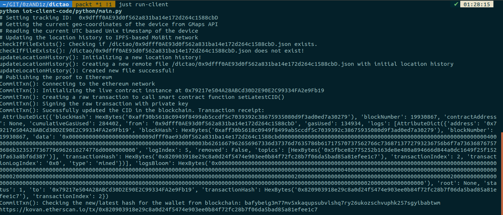
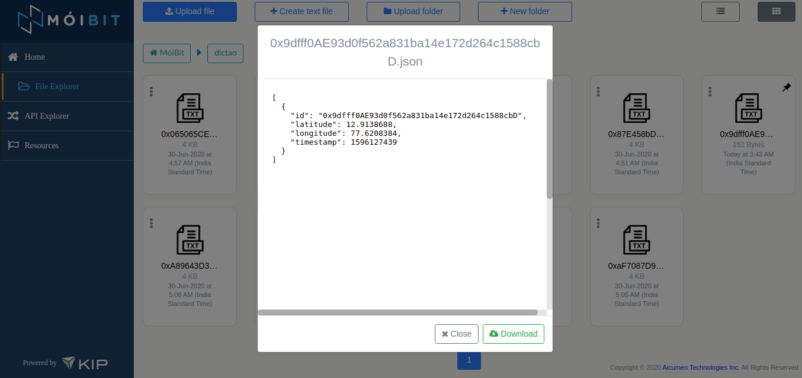
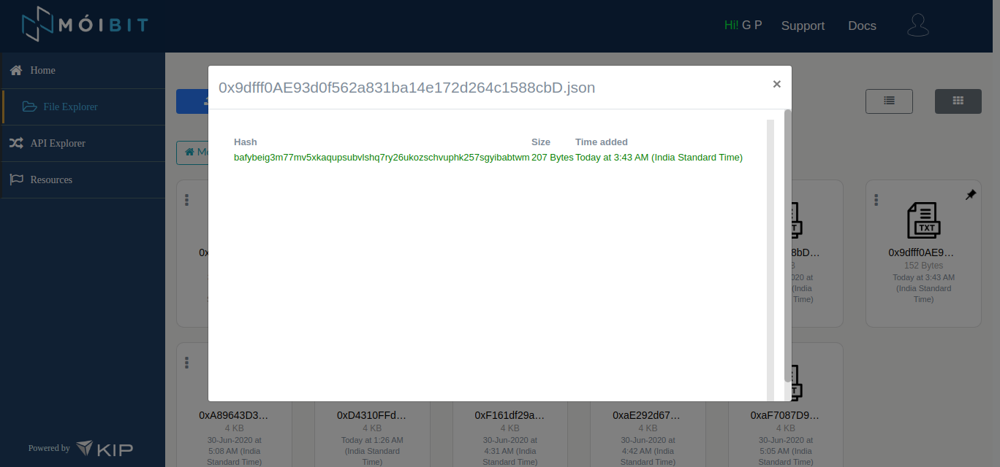
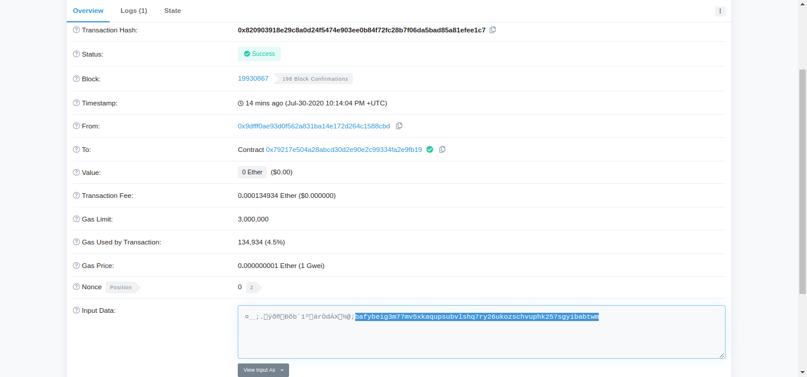
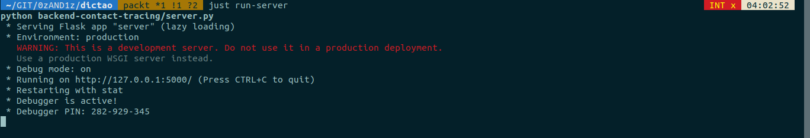
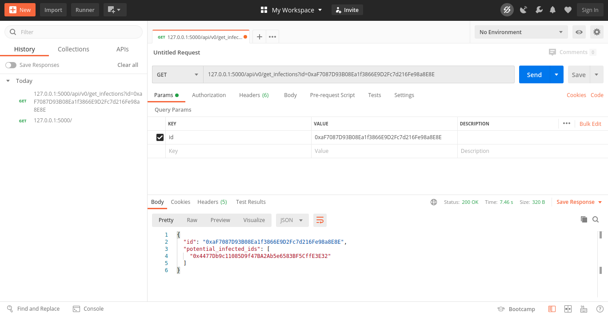
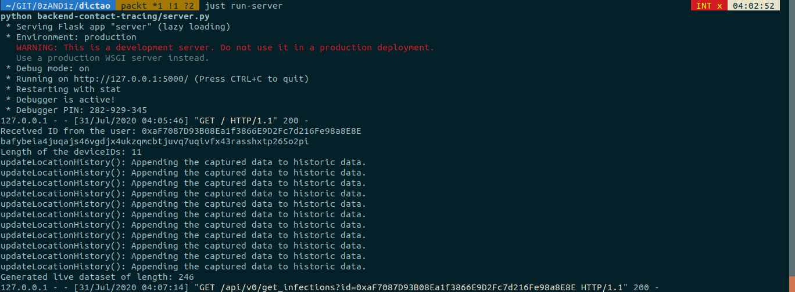
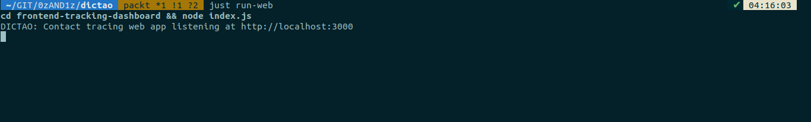
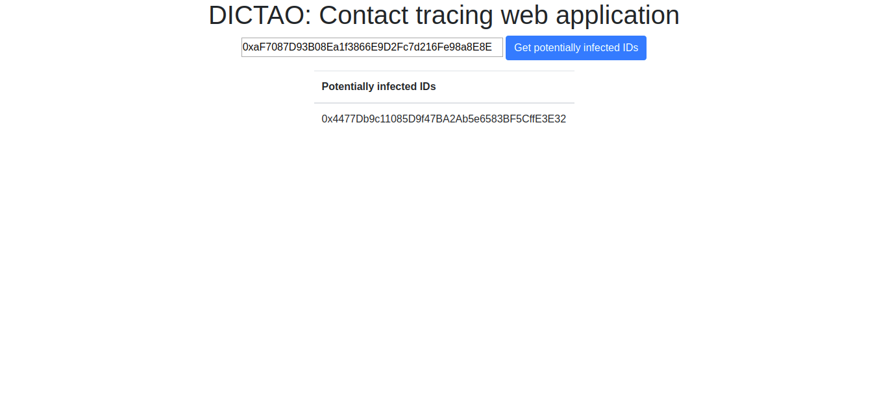

# Instructions for Ubuntu / linux users

PURPOSE: Use this document to setup the DICTAO code repository on your ubuntu / linux machine.

## Ubuntu

Using the Ubuntu 18.04.4 LTS, I have tested the python implementation of the IoT client code, and backend contact tracing API. I have also tested the deployment of the location update proof smart contract on Remix IDE. Lastly, I have also tested the Node.JS implementation of the front-end web dashboard.

To follow the tutorial in Chapter 8, let us understand how to setup the code one step at a time.

### Installing software

**Rust and cargo**

By installing `rust`, we also get `cargo` installed in our system. We use cargo to install the `just` command.  

Visit https://rustup.rs/ or use the following command to install rust:

```sh
$ curl --proto '=https' --tlsv1.2 -sSf https://sh.rustup.rs | sh
```

**Just**

By using the `just` command, we can use environment variables to define our credentials and safely share the credentials with the processes.  

With rust and cargo installed, we can install `just` by simply executing the following command:

```sh
$ cargo install just
```

**Python and pip**

Our IoT sensor client code and the backend API for contact tracing is implemented in Python. So we need the `pip` and `python` commands to install dependencies and run the software.

Just run the following commands to install Python3 and pip:

```sh
$ sudo apt-get install software-properties-common
$ sudo add-apt-repository ppa:deadsnakes/ppa
$ sudo apt-get update
$ sudo apt-get install python3.6
```

If you want to maintain two different versions of Python, you can also use [`pyenv`](https://github.com/pyenv/pyenv) to install Python3.

**Node.JS and npm**

The front end web dashboard is used to perform digital contact tracing. The dashboard is a simple HTML file hosted using an express server. So we need Node.JS and npm.

To install the latest LTS versions of NodeJS and npm, execute these commands:

```sh
$ curl -sL https://deb.nodesource.com/setup_12.x | sudo -E bash -
$ sudo apt-get install -y nodejs
```

**Brave browser**

I recommend you to use the Brave browser to practice this tutorial. Read more about Brave at www.brave.com.

Visit https://brave-browser.readthedocs.io/en/latest/installing-brave.html#linux or use these commands to install the latest version of Brave browser:

```sh
$ sudo apt install apt-transport-https curl

$ curl -s https://brave-browser-apt-release.s3.brave.com/brave-core.asc | sudo apt-key --keyring /etc/apt/trusted.gpg.d/brave-browser-release.gpg add -

$ echo "deb [arch=amd64] https://brave-browser-apt-release.s3.brave.com/ stable main" | sudo tee /etc/apt/sources.list.d/brave-browser-release.list

$ sudo apt update

$ sudo apt install brave-browser
```

**Postman**

I use Postman to demonstrate the input and output characteristics of the contact tracing API.

Simply visit https://www.postman.com/downloads/ and click on the download button. You may have to select the appropriate version of the download based on the type of Ubuntu OS installed.

**Jupyter Notebook**

In Chapter 8, I have also explained how to train the DBSCAN based contact tracing model. If you would like to practice it on your system locally, install the Jupyter Notebook.

If you are not a AI geek(yet) and want a minimal setup, you can install it using this command:

```sh
$ pip install jupyterlab
```

Once installed, you can visit https://github.com/madatpython/PRANA/blob/packt/prana_contact_tracing_using_DBSCAN.ipynb to practice the tutorial.

### Signing up for services

**Google Maps Platform**

Google Maps Platforms offers a wide range of GPS-based services. We use the geolocation API offered by this platform in our IoT client code to fetch the current latitude and longitude.

Follow these instructions to setup your geolocation API:

1. Signup for a free trial on the Google Cloud Platform [here](https://console.cloud.google.com/freetrial). You may have to enter your debit/credit card details to complete the signup.

2. After successful signup, create a new project [here](https://console.cloud.google.com/projectcreate). You may name the project as `dictao`.

3. Before creating an API key, we need to enable the Geolocation API. Visit the [Google Maps API list](https://console.cloud.google.com/google/maps-apis/api-list) page and click on Geolocation API under **Additional APIs**. Now, click the "ENABLE" button.

4. To confirm if the Geolocation API enabled, visit the API list page again. The Geolocation API should now be listed under **Enabled APIs**.

5. Now, follow [this](https://developers.google.com/maps/premium/apikey/geolocation-apikey#get-key) instruction to get the API key.

6. Once the API key is generated, it is important to protect it from ill-use. You may want to follow [these](https://developers.google.com/maps/premium/apikey/geolocation-apikey#restrict-key) instructions to protect your API by restricting access. Using these instructions, you can limit the requests from your own IP address and limit the scope of the request to Geolocation API.

7. You can now visit the [Credentials page](https://console.cloud.google.com/google/maps-apis/credentials) to copy the API key. We'll need it while configuring our `justfile`.

**MoiBit API**

We use MoiBit to securely store the location history of each sensor.

Follow these instructions to setup your MoiBit API:

1. Visit the [MoiBit signup page](https://account.moibit.io/#/signup) and submit the form

2. Verify your email and log in to MoiBit

3. Visit the [home/dashboard page](https://account.moibit.io/#/home) to access the API key and secret

4. Now, visit the [file explorer page](https://account.moibit.io/#/fileexplorer) and create a new folder by clicking on the "New folder" button. Now, enter the folder name as **dictao** and click on the submit button.

5. We will be using this folder to store the location history of one or more sensors and use it to perform contact tracing

**Infura**

We use Infura to access the Ethereum Kovan testnet.

Follow these instructions to setup your Infura account:

1. Visit the Infura signup page [here](https://infura.io/register) and submit the form

2. You may have to verify your email before logging in to Infura

3. Visit the [dashboard](https://infura.io/dashboard/ethereum) and click on "CREATE NEW PROJECT" button

4. You can enter the name as **dictao** and press "CREATE" button

5. Now, you are automatically redirected to your newly created project. Your **Project ID** can be found in the same page. We'll need it while configuring the `justfile`.

**Metamask**

Finally, we need to create an ethereum account and designate it uniquely for each sensor. For the sake of simplicity, I recommend using Metamask to create ethereum wallets and export their wallet address and private key.

Follow these instructions on your brave browser:

1. Visit the [Metamask download page](https://metamask.io/download.html)

2. Click on the Brave browser icon or visit [this](https://chrome.google.com/webstore/detail/metamask/nkbihfbeogaeaoehlefnkodbefgpgknn?hl=en) page

3. Click on the "Add to brave" button. You'll be asked to confirm again by clicking the "Add extension" button

4. You'll now be redirected to your local web page of the MetaMask. Click on "Get started" button.

5. Now, click on "Create a Wallet" to create a new Ethereum wallet

6. You may choose to share your usage data by clicking on "I agree" button

7. Enter a strong password and confirm it again. You may have to accept the terms and coniditions before clicking on "Create" button.

8. Follow the instructions suggested in the next screen "Secret Backup Phrase"

9. After backing up your seedphrase, you need to click on "Account 1" to copy the wallet address. We need this address while configuring our `justfile`.

10. Right next to the "Account 1", you can click on "Account details" option from the dropdown menu and click on the "Export Private Key" button.

11. Type your password and copy your account's private key. We also need this while configuring our `justfile`.

**NOTE:** You need to maintain enough balance to run the tutorial. Visit https://faucet.kovan.network/ and authenticate yourself with GitHub to receive one Kovan Ether (KETH).

### Deploying your smart contract

Each time a sensor updates its location on MoiBit, we need to maintain a proof of it on a transparent ledger accessible to everyone. In this tutorial, we achieve this using a smart contract on the Ethereum Kovan testnet.

**NOTE:** For simplicity, I recommend you to use the smart contract that has been already deployed by me on the Kovan testnet. The address of the smart contract is `0x79217e504A28ABCd30D2E90E2C99334FA2e9Fb19`. You can visit [Etherscan](https://kovan.etherscan.io/address/0x79217e504A28ABCd30D2E90E2C99334FA2e9Fb19) to review all the transactions committed by the sensor for each successful location history update made in MoiBit.

If you are interested in venturing out and using your own contract, you may use the [Remix IDE](https://remix.ethereum.org/) to deploy the smart contract and populate enough data required to perform contact tracing:.

### Configuring your justfile

If you apply the credentials from the previous section in the respective export command, it'll probably look like this:

```yaml
export GMAPS_API_KEY := "ABCDEFGHIJKL..."
export MOIBIT_API_KEY := "ABCDEFGHIJKL..."
export MOIBIT_API_SECRET := "VERYLONGSTRING..."
export WEB3_INFURA_PROJECT_ID := "ABCD..."
export PROOF_SMART_CONTRACT_ADDRESS := "0x79217e504A28ABCd30D2E90E2C99334FA2e9Fb19"
export WALLET_PRIVATE_KEY := "LONGSTRING...."
export WALLET_ADDRESS := "0xWALLETADDRESS"

run-client:
    python iot-client-code/python/main.py

run-web:
    cd frontend-tracking-dashboard && node index.js

run-server:
    python backend-contact-tracing/server.py

install-dependencies:
    pip install --user -r requirements.txt
    cd frontend-tracking-dashboard && npm install
```

We are now ready to run the tutorial and have some fun!

### Installing dependencies

First things first, we need to install all the dependencies used by our Python and Node implementations. So, you'll need to execute the following just command:

```sh
$ just install-dependencies
```

This will automatically install all the pip and npm dependencies so that you don't have to.

### Running the IoT client code

It all starts when an sensor updates its latest location to MoiBit. We can check this out by running:

```sh
$ just run-client
```

You will be able to observe similar output as follows:


When you visit the **dictao** folder in MoiBit's file explorer page, you should be able to view a new file as shown below:


When you select the "Version" under the dropdown menu of the file, you can observe the hash same hash as captured in the terminal as follows:


The proof of this location history update is committed to the Ethereum Kovan testnet. We can verify this by opening the link mentioned at the bottom of the console output shown in the first screenshot. The file hash has been inputted in the transaction as shown below:


### Running the backend contact tracing API

You need to run the above commands from several sensors having distinct wallet address and location history. I have reduced your effort here by populating the location history of more than 10 sensors in the smart contract address mentioned in the justfile.

So, let us run the contact tracing API using the following command:

```sh
$ just run-server
```

If your console displays the following output, the server has been initiated properly:


Let us now use Postman to test the API with sample inputs as follows:

As you can observe from the above screenshot, the API received an "id" as an input and returned a response body consisting of all the potentially infected IDs. This is made possible with the help of the DBSCAN algorithm explained in Chapter 8.

Meanwhile, you can observe the following update in your console:


From the above screenshot, we can understand that the API is downloading the entire dataset from MoiBit, performing contact tracing and returning a list of infected IDs back to the client with the HTTP 200 response code.

### Running the web dashboard

The API must be accessed via a simple web dashboard to inquire for potential contacts / infections made by the given ID.

Let us launch the dashboard by running the following command:

```sh
$ just run-web
```

If all the dependencies are installed properly, you should be able to observe the following output from the console:


Let us now visit http://localhost:3000/ and enter the same sensor wallet address `0xaF7087D93B08Ea1f3866E9D2Fc7d216Fe98a8E8E`. We will obtain the results in the tabulated format as follows:

From the above screenshot, we have a functional contact tracing dashboard that can search for potential infections associated with a suspected sensor.

This summarizes how to run the DIApp on your Ubuntu linux machine.

## Got any other Linux distros?

If you would like to document the instructions for other linux distributions, please fork the [dictao](https://github.com/0zAND1z/dictao) repository and submit your PR!
